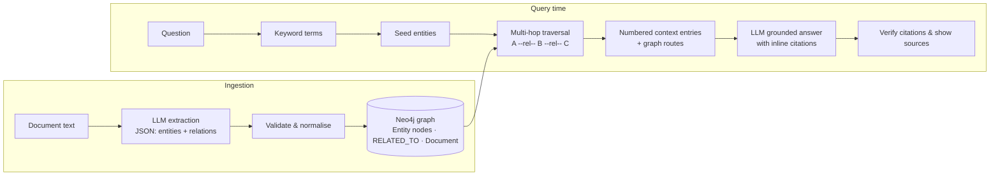

# Nexora

**Knowledge Graph Intelligence Engine**

Nexora turns plain-text documents into a typed **knowledge graph** stored in
Neo4j, then answers natural-language questions by **walking that graph**
(multi-hop retrieval) and letting a **local LLM** reason over the retrieved
evidence — with every claim traceable back to the source excerpt it relies on.

It is a self-contained implementation of the **GraphRAG** workflow:

```
Document → Extraction → Graph → Retrieval → Traversal → Context → LLM → Answer → Citations
```

---

## Overview

Most question-answering tools only look for text snippets that literally
contain your keywords. Nexora goes one step further: it first converts each
document into *entities* and the *relationships* between them, stores that
structure in Neo4j, and then answers questions by finding starting entities
and expanding **several relationship hops** into the graph. This is how facts
that live in *different* documents get joined into a single, grounded answer.

Because inference runs through **Ollama**, everything stays local: your
documents, your graph and your model never leave your machine.

## Key Features

- **Knowledge Graph** — documents become typed entity nodes and labelled
  relationships in Neo4j. The same entity mentioned in several documents
  collapses into a single node, so facts from separate sources can be joined.
- **GraphRAG retrieval** — a question is decomposed into search terms, matching
  entities become starting points, and the graph is walked several hops to
  collect connected evidence.
- **Multi-hop retrieval** — indirect connections (`A —[rel]— B —[rel]— C`) are
  discovered automatically; every piece of evidence records the graph route
  used to reach it.
- **Local LLM inference** — extraction and grounded answering run on your own
  model through Ollama (e.g. `llama3.2`), configurable at runtime.
- **Neo4j integration** — robust, parameterised Cypher, lazy connection
  management and live connectivity diagnostics.
- **Provenance & citations** — the model is instructed to cite evidence inline
  as `[1]`, `[2]`; Nexora resolves every citation back to the source document,
  excerpt and graph route, and only ever displays citations that map to real
  retrieved evidence.
- **Document ingestion** — paste text or load built-in example documents that
  are designed to demonstrate cross-document joins.
- **Document provenance nodes** — each ingested document is stored as a graph
  node with its source text, so source tracking survives entity merging.
- **Diagnostics panel** — one-click health checks for Neo4j, the Ollama
  service, the configured model and the current graph contents.
- **No secrets in code** — all credentials arrive via environment variables or
  a local `.env` file; nothing is hard-coded.

## Architecture

```
┌────────────────────────────── INGESTION ──────────────────────────────┐
│                                                                       │
│   document text  ──►  local model extracts a JSON graph               │
│                           (entities + relations)                      │
│                                │                                      │
│                                ▼                                      │
│   entities merged into Neo4j by stable name-derived key               │
│   relations created only when both endpoints exist                    │
│   document registered as a provenance node                            │
│                                                                       │
└───────────────────────────────────────────────────────────────────────┘

┌──────────────────────── RETRIEVAL + GENERATION ──────────────────────┐
│                                                                       │
│   question ──► keywords ──► ranked seed entities                      │
│                                │                                      │
│                                ▼                                      │
│   walk N hops from each seed (multi-hop traversal)                    │
│                                │                                      │
│                                ▼                                      │
│   assemble numbered evidence + graph routes                            │
│                                │                                      │
│                                ▼                                      │
│   local model answers, citing [n] entries inline                      │
│                                │                                      │
│                                ▼                                      │
│   verify citations ──► resolve to sources, excerpts & routes          │
└───────────────────────────────────────────────────────────────────────┘
```

### Mermaid



### Separation of concerns

- `app.py` and the `nexora/ui` package handle **presentation only**.
- All domain work sits behind `KnowledgeAssistant` in `nexora/service.py`.
- Every Cypher statement lives in `nexora/db/statements.py`.
- Prompt templates are isolated in `nexora/llm/prompts.py`.
- Configuration is centralised in `nexora/config.py`.
- The only module that touches the Neo4j driver is `nexora/db/connector.py`;
  the only module that touches the Ollama client is `nexora/llm/gateway.py`.

## Technology Stack

| Layer        | Technology                                             |
| ------------ | ------------------------------------------------------ |
| Language     | Python 3.9+                                            |
| Interface    | Streamlit                                              |
| Graph store  | Neo4j (official `neo4j` driver)                        |
| LLM gateway  | Ollama (official `ollama` Python client)               |
| Container    | Docker + Docker Compose (optional)                     |
| Testing      | pytest                                                 |

## Project Structure

```
.
├── app.py                       # Streamlit entry point (run this)
├── nexora/
│   ├── config.py                # Settings record, .env loading, logging
│   ├── errors.py                # typed errors + exception translators
│   ├── models.py                # domain records & stable entity ids
│   ├── samples.py               # built-in demo documents & questions
│   ├── service.py               # KnowledgeAssistant facade
│   ├── db/
│   │   ├── connector.py         # Neo4j driver lifecycle (sole usage)
│   │   ├── statements.py        # every Cypher statement + schema
│   │   └── repository.py        # KnowledgeBase read/write operations
│   ├── llm/
│   │   ├── gateway.py           # InferenceGateway over the Ollama client
│   │   └── prompts.py           # extraction + answering prompts
│   ├── pipeline/
│   │   ├── extraction.py        # document -> validated entities/relations
│   │   ├── retrieval.py         # keywords -> seeds -> multi-hop context
│   │   └── answering.py         # evidence -> answer + citation check
│   └── ui/                      # Streamlit views (the only Streamlit layer)
│       ├── __init__.py          # app wiring / tabs
│       ├── theme.py             # brand palette, CSS, HTML helpers
│       ├── state.py             # session-state & error helpers
│       ├── sidebar.py           # connection settings panel
│       ├── ingest_view.py       # document ingestion tab
│       ├── ask_view.py          # question answering tab
│       └── status_view.py       # diagnostics & graph overview tab
├── tests/                       # unit tests (no external services needed)
├── docs/
│   └── NEXORA_PROJECT_GUIDE.md  # complete technical handbook
├── .env.example                 # copy to .env and fill in
├── requirements.txt
├── requirements-dev.txt
├── Dockerfile
├── docker-compose.yml           # Neo4j + Ollama + Nexora together
└── .streamlit/config.toml       # visual theme
```

## Requirements

- **Python** 3.9 or newer
- **Neo4j** — a running instance (Community Edition is enough)
- **Ollama** — a running service with at least one chat model pulled
  (e.g. `ollama pull llama3.2`)

Python dependencies are intentionally few:

- `streamlit` — the interface
- `neo4j` — the official database driver
- `ollama` — the official Ollama client

## Installation

```bash
# 1. Create and activate a virtual environment
python -m venv .venv
# Windows:
.venv\Scripts\activate
# macOS / Linux:
# source .venv/bin/activate

# 2. Install dependencies
pip install -r requirements.txt

# 3. Configure the environment
cp .env.example .env   # Windows:  Copy-Item .env.example .env
```

Nexora reads `.env` from the repository root automatically, so on most systems
you never need to export variables yourself. Every variable is optional and
has a sensible default aimed at local development.

## Neo4j Setup

The fastest path to a local database is Docker:

```bash
docker run -d --name nexora-neo4j \
  -p 7474:7474 -p 7687:7687 \
  -e NEO4J_AUTH=neo4j/password \
  neo4j:latest
```

Then point Nexora at it with:

```
NEO4J_URI=bolt://127.0.0.1:7687
NEO4J_USER=neo4j
NEO4J_PASSWORD=password
```

You can also run Neo4j, Ollama **and** Nexora together with a single command —
see [Docker Compose](#docker-compose-optional).

## Ollama Setup

Install Ollama for your platform ([ollama.com](https://ollama.com)), then pull
the model you want to use:

```bash
ollama pull llama3.2
```

Set `OLLAMA_BASE_URL` if Ollama is not on `http://127.0.0.1:11434`, and
`OLLAMA_MODEL` to the tag you pulled. The model is resolved at runtime, so you
can switch freely without changing code.

## Environment Configuration

| Variable                | Default                     | Purpose                                            |
| ----------------------- | --------------------------- | -------------------------------------------------- |
| `NEO4J_URI`             | `bolt://127.0.0.1:7687`     | Neo4j connection URI                               |
| `NEO4J_USER`            | `neo4j`                     | Neo4j user name                                    |
| `NEO4J_PASSWORD`        | *(empty)*                   | Neo4j password                                     |
| `NEO4J_DATABASE`        | *(empty)*                   | Database name; server default when blank           |
| `OLLAMA_BASE_URL`       | `http://127.0.0.1:11434`    | Ollama HTTP endpoint                               |
| `OLLAMA_MODEL`          | `llama3.2`                  | Model tag used for extraction and answering        |
| `NEXORA_RETRIEVAL_DEPTH`| `2`                         | Relationship hops walked per seed (1–6)            |
| `NEXORA_CONTEXT_LIMIT`  | `18`                        | Max evidence entries in an answer prompt (4–60)    |
| `NEXORA_ENTRY_LIMIT`    | `8`                         | Max seed candidates returned by keyword search (1–30) |
| `NEXORA_LLM_TIMEOUT`    | `300`                       | Seconds to wait for one Ollama request (5–3600)    |
| `NEXORA_LOG_LEVEL`      | `INFO`                      | Log level for the `nexora` logger tree             |

> Real environment variables take precedence over values in `.env`.

Every connection-related value can also be changed at runtime from the
**sidebar** of the running app; those overrides apply to the current browser
session only.

## Running Nexora

```bash
streamlit run app.py
```

Open the printed URL (normally `http://localhost:8501`).

### Using Nexora

1. Start Neo4j and Ollama, pull your model, and configure `.env` (see above).
2. Launch the application with `streamlit run app.py`.
3. On the **Ingest knowledge** tab, pick a built-in example (or paste your own
   text), give the document a label, and press *Analyse and index*.
4. Repeat with a second example — the sample documents share entities, which
   demonstrates cross-document joins.
5. On the **Ask a question** tab, try a suggested question or ask your own.
6. Open the **System status** tab to run diagnostics and inspect (or erase) the
   graph.

### Docker Compose (optional)

The bundled compose file starts Neo4j, Ollama and the Streamlit app and wires
them together with the correct addresses:

```bash
docker compose up --build
```

Ollama inside the container starts empty; pull a model once it is healthy:

```bash
docker exec nexora-ollama ollama pull llama3.2
```

## Architecture Details

### Ingestion

1. Paste a document (or load a built-in example) and give it a reference
   label.
2. Nexora asks the local model to return a strict JSON structure: `entities`
   (name, type, one-sentence summary) and `relations` (source, target,
   predicate, context). Malformed or prose-wrapped JSON, duplicate entities,
   and relations with unknown endpoints are all normalised or rejected.
3. The document is registered as a provenance node with its source text.
4. Each entity is merged into the graph using a stable identifier derived from
   its normalised name, so repeated mentions across documents enrich the same
   node and keep it linked to every document that mentions it.
5. Each relation is created only if **both** endpoints already exist; orphaned
   relations are skipped and reported.
6. The extraction result is shown as tables so you can review what was stored.

### Retrieval

1. The question is tokenised into concrete keywords (stop-words removed).
2. Nodes whose name, type or summary contain any keyword become candidate
   *seeds*, ranked by how many keywords each one actually matches.
3. From the top seeds the graph is walked up to `NEXORA_RETRIEVAL_DEPTH` hops;
   every reached entity becomes a context entry together with the route
   `A --[predicate]-- B --[predicate]-- C` that led to it.
4. Entries are numbered and handed to the model with the instruction to ground
   every claim in one or more of them and to cite them inline as `[1]`, `[2]`.

## Provenance

Provenance is a first-class Nexora feature:

- Every extracted entity remembers the document it came from (and is linked to
  the document node).
- Every retrieved evidence entry carries the source label and the graph route
  that reached it.
- The answering prompt asks the model to cite the entries it relies on.
- After generation, Nexora parses every bracket citation and **only** keeps
  those that resolve to a real evidence entry.
- The UI renders the answer with an expandable list of sources: each source
  shows the document, an excerpt from it, and the graph route used to reach
  the entity.

Nexora never fabricates citations — a claim without a verifiable reference is
simply shown without one.

## Troubleshooting

| Symptom | Likely cause / fix |
| --- | --- |
| "Could not reach the Neo4j server" | The database is not running or the URI/port is wrong. Start it and verify `NEO4J_URI`. |
| "Neo4j rejected the credentials" | Wrong `NEO4J_USER` / `NEO4J_PASSWORD`. |
| "Could not reach the Ollama service" | Ollama is not running or `OLLAMA_BASE_URL` is wrong. |
| "The requested model is not installed" | Run `ollama list`; pull the model with `ollama pull <tag>`. |
| "No entities could be extracted" | The model returned unusable JSON, or the text is too short/vague. Confirm the model works in `ollama run <tag>`. |
| "Nothing matched this question" | The question uses words not present in the graph. Ingest related documents or rephrase. |
| Answers rarely cite sources | Smaller models skip inline citations. Re-ask, raise `NEXORA_CONTEXT_LIMIT`, or use a larger model. |
| Model requests hang | The model may still be loading. Raise `NEXORA_LLM_TIMEOUT`. |

## Development

```bash
pip install -r requirements-dev.txt
python -m pytest
```

Work on the engine without touching the UI (`nexora/*`), and keep Streamlit
code inside `nexora/ui`. See `docs/NEXORA_PROJECT_GUIDE.md` for the complete
developer handbook: architecture, data flow, per-module reference, Neo4j and
Ollama guides, maintenance recipes and known limitations.

## Testing

Unit tests cover configuration loading, entity identifiers, extraction
parsing, retrieval term/ranking logic, context assembly, prompt formatting,
citation verification and gateway response handling. They require **no** live
Neo4j or Ollama server:

```bash
python -m pytest
```

## License

No license is declared for this repository.
